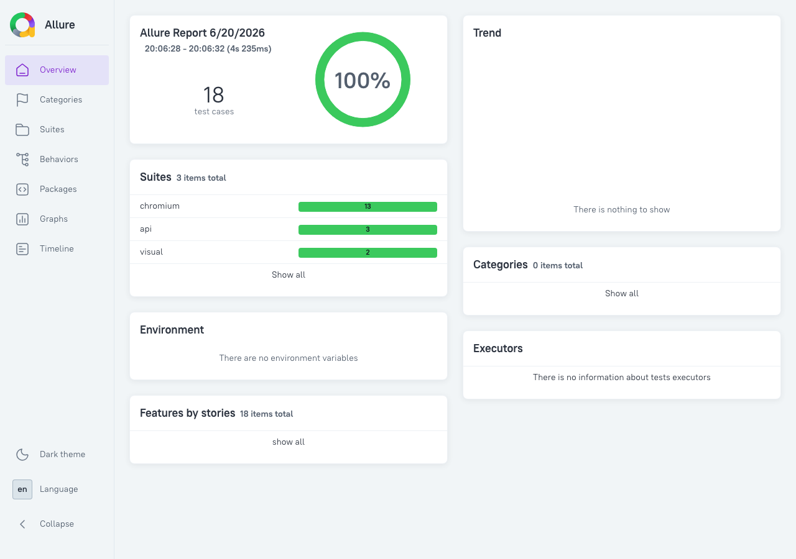

# QA Shop — E2E & API Test Automation


Pet-проект интернет-витрины **QA Shop** для портфолио: manual QA + junior/hybrid AQA.  
Собственный стенд (React + Express), **18 автотестов** (13 UI + 2 visual + 3 API), Page Object Model, CI, Allure.

**English summary:** Monorepo demo e-commerce app with Playwright TypeScript tests (POM, hash-accelerated visual snapshots, API layer, GitHub Actions, Allure).

---

## Стек

| Слой     | Технологии                                                  |
| -------- | ----------------------------------------------------------- |
| Frontend | Vite, React, TypeScript, React Router                       |
| Backend  | Express, TypeScript                                         |
| Tests    | Playwright, POM, hash-first visual snapshots, `request` API |
| Quality  | ESLint, Prettier, Allure                                    |
| CI       | GitHub Actions (Node 20)                                    |
| Infra    | Docker Compose (web + api)                                  |

---

## Быстрый старт

**Требования:** Node.js ≥20, npm. Для Allure HTML локально — Java 8+.

```bash
git clone https://github.com/NikoloDub/qa-playwright-portfolio.git
cd qa-playwright-portfolio
npm install
npx playwright install chromium   # первый раз

npm run dev    # Web :5173 + API :3001 (опционально, для ручной проверки)
npm test       # e2e + api (app поднимается автоматически)
```

**Демо-логин:** `demo` / `demo123`

### Docker (стенд одной командой)

**Требования:** Docker + Docker Compose.

```bash
docker compose up --build -d
# UI → http://localhost:5173
```

Подробнее: [`docs/docker.md`](./docs/docker.md)

---

## Команды

| Команда                      | Описание                           |
| ---------------------------- | ---------------------------------- |
| `npm run dev`                | API + Web                          |
| `npm test`                   | Все тесты (Playwright)             |
| `npm run test:e2e`           | Только UI                          |
| `npm run test:api`           | Только API                         |
| `npm run test:visual`        | Visual snapshot-тесты (hash-first) |
| `npm run test:visual:update` | Обновить PNG + `.hash` эталоны     |
| `npm run test:ui`            | Playwright UI mode                 |
| `npm run lint`               | ESLint                             |
| `npm run format:check`       | Prettier                           |
| `npm run test:allure`        | Тесты + генерация Allure           |
| `npm run allure:open`        | Открыть Allure HTML                |
| `npm run docker:up`          | Docker: web + api                  |
| `npm run docker:down`        | Остановить контейнеры              |

---

## Структура

```
├── apps/web/           # React UI (Login, Catalog, Cart, Checkout, Profile)
├── apps/api/           # Express API
├── tests/e2e/          # UI: pages/, fixtures/, helpers/, specs/
├── tests/api/          # API specs
├── playwright.config.ts
├── docker-compose.yml
├── .github/workflows/  # CI
└── docs/               # test-plan, allure, ci, visual-hash, roadmap
```

---

## Отчёты

### Allure

```bash
npm run test:allure
npm run allure:open
```

После push в GitHub: **Actions → run → Artifacts → `allure-report`** → скачать zip → открыть `index.html`.



_Отчёт из CI: 18 passed (13 e2e + 2 visual + 3 api)._

### Playwright HTML

```bash
npm run test:report
```

### Visual regression (hash-first)

Двухфазная проверка UI (идея с **SQA Days 36**, В. Техтилов):

1. **Perceptual hash** — быстрый pass, если UI не менялся
2. **Pixel diff** Playwright — только при расхождении hash (скрин diff в отчёте)

```bash
npm run test:visual
npm run test:visual:update   # обновить PNG + .hash эталоны
```

Подробнее: [`docs/visual-hash.md`](./docs/visual-hash.md)

---

## CI

Pipeline: **Lint** (ESLint + Prettier) → **Test** (18 tests) → upload artifacts.

Перед push: `npm run lint && npm run format:check && npm test`

Подробнее: [`docs/ci.md`](./docs/ci.md)

---

## Тест-план

Полная таблица сценариев: [`docs/test-plan.md`](./docs/test-plan.md)

| Категория | Кол-во                  |
| --------- | ----------------------- |
| E2E UI    | 13 (12 сценариев + 404) |
| Visual    | 2 (Login, Catalog)      |
| API       | 3                       |

---

## Roadmap

Планы развития: [`docs/roadmap.md`](./docs/roadmap.md)

---

## Для резюме

Разработал pet-проект **QA Shop** — monorepo с React-витриной и Express API. **13 e2e** + **visual regression** (hash-first → pixel diff, идея SQA Days) + **API-тесты** на Playwright + TypeScript (POM, fixtures). GitHub Actions, Allure, Docker Compose.

---

## Автор

**Николай Дубинин** — Manual QA, цель hybrid / junior AQA.

---

## Лицензия

[MIT](./LICENSE)
